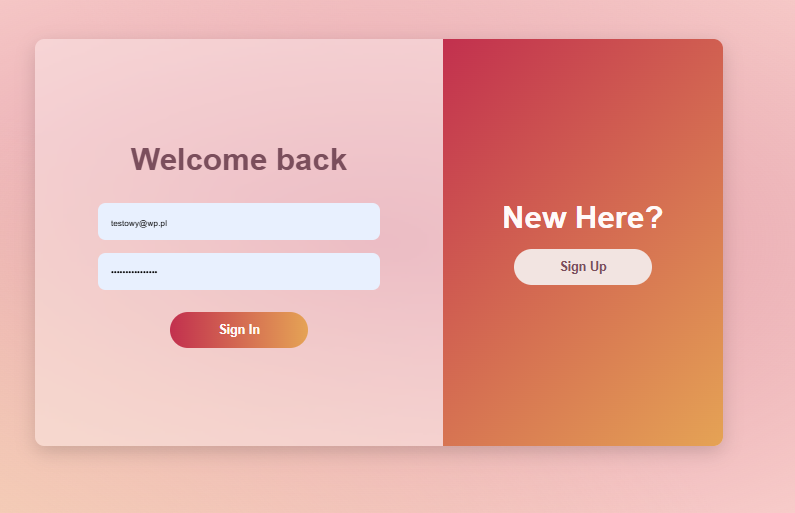
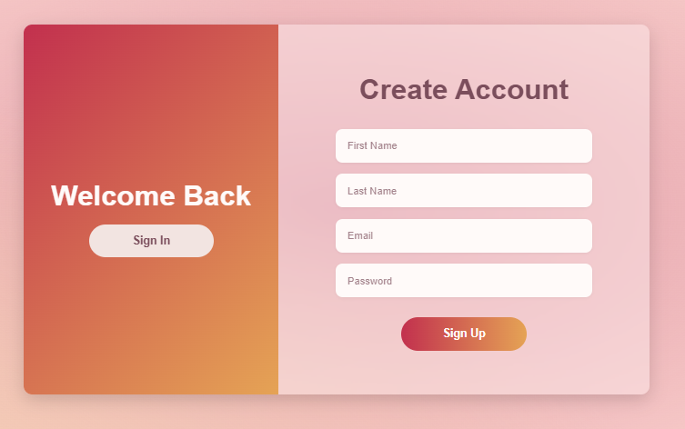
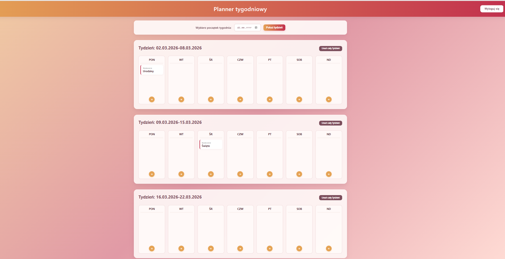
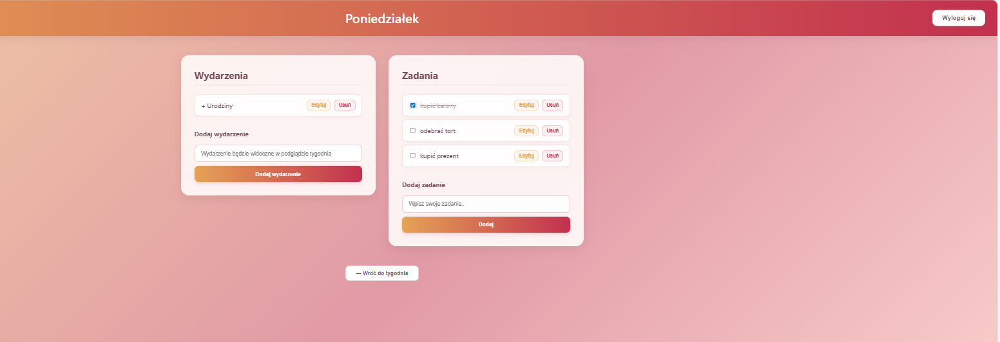

Aplikacja "Weekly Planner"
## Autor: Julia Szymczyk

## Zrzuty ekranu

### Logowanie

### Rejestracja

### Podgląd tygodnia

### Dodawanie wydarzeń i zadań

## Technologie
- Node.js
- Express.js
- MongoDB
- Mongoose
- HTML
- CSS
- JavaScript

## Funkcjonalności
- rejestracja i logowanie użytkownika
- logowanie na własne konto
- dodawanie nowych tygodni
- usuwanie wybranych tygodni
- przechodzenie do widoku konkretnego dnia
- dodawanie zadań do wybranego dnia
- dodawanie wydarzeń do wybranego dnia
- wyświetlanie wydarzeń w oknie podglądu tygodnia
- edytowanie zadań i wydarzeń
- usuwanie zadań i wydarzeń
- oznaczanie zadań jako wykonane poprzez ich przekreślenie

## Konto testowe
Login: `testowy@wp.pl`  
Hasło: `Testowe_konto123`
